#hMeDIP-Seq
##数据来源与下载

| SRA号 | 样本名 |
| ---- |  ---- |
| SRR3330428 | 5hmC_Adult_rep1 |
| SRR3330429 | 5hmC_Adult_rep2 |
| SRR3330426 | 5hmC_Neonatal_rep1 |
| SRR3330427 | 5hmC_Neonatal_rep2 |
| SRR3330440 | INPUT_DNA_Adult_rep1 |
| SRR3330441 | INPUT_DNA_Adult_rep2 |
| SRR3330438 | INPUT_DNA_Neonatal_rep1 |
| SRR3330439 | INPUT_DNA_Neonatal_rep2 |

通过NCBI官方推荐的prefetch来下载数据：
```
prefetch SRR3330428 SRR3330429 SRR3330426 SRR3330427 SRR3330440 SRR3330441 SRR3330438 SRR3330439
```
下载的数据会存储在这个目录下：~/ncbi/public/sra/ ，
注意查看下载数据是否完整！
然后通过mv将其移动到指定文件夹，并重新命名（重命名名字为上述样本名）。
##转换为fastq数据
```
ls *sra | while read id; 
do 
	fastq-dump --gzip --split-files -O fastq/ ${id} ; 
done
```
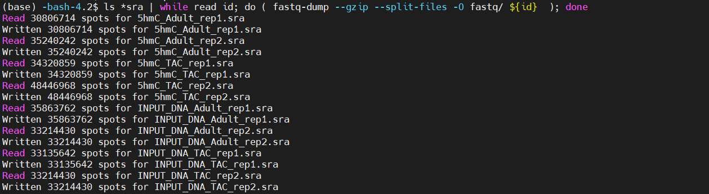
只出现_1表明为单端数据。
##质控
FastQC质量控制+MultiQC对FastQC结果进行整合
```
ls *gz | sed 's/_[0-9].fastq.gz//g' | sort -u | while read id; 
do
	fastqc -t 8 ${id}_1.fastq.gz  -o ./QC_results; 
done
multiqc ./QC_results/
```
以第一个5hmC_Adult_rep1结果为例：
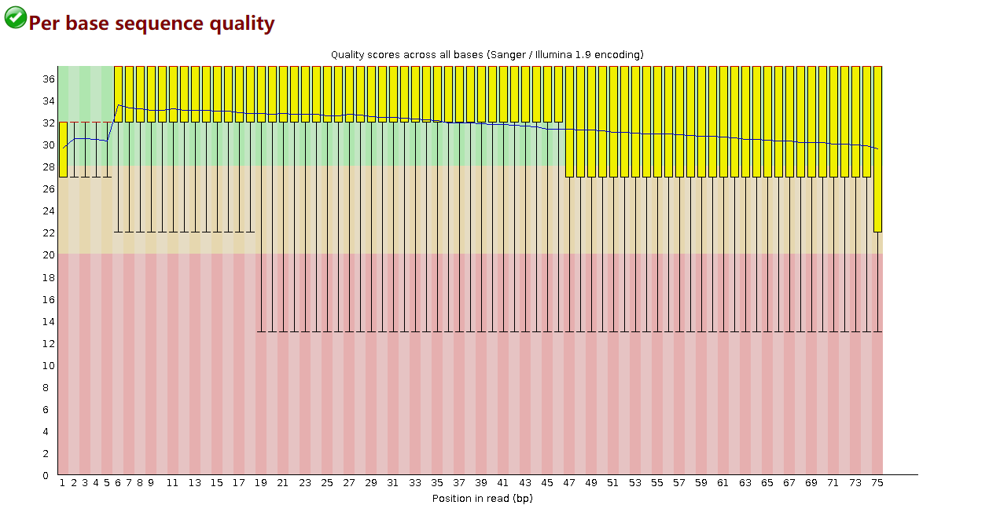
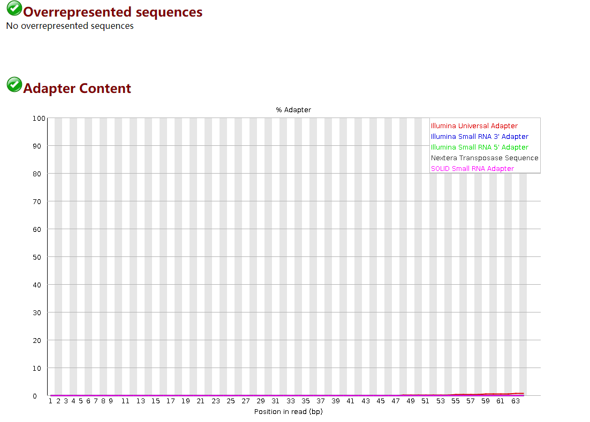
multiqc结果：
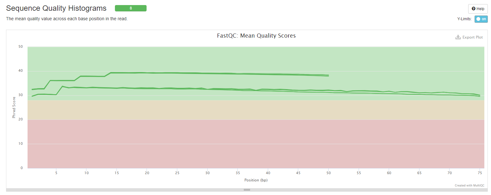
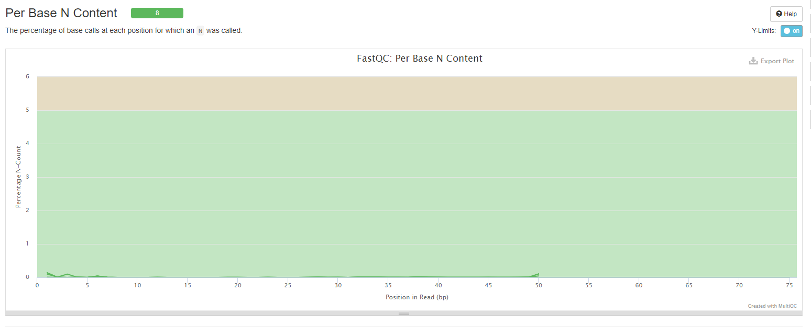
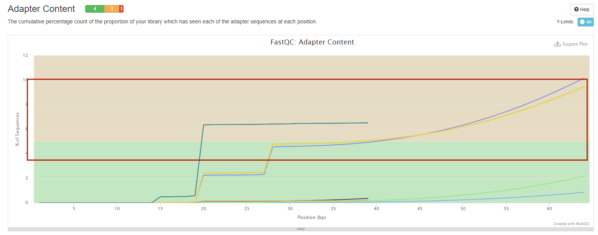
可见有接头污染！
利用fastp过滤低质量序列、修剪接头序列，然后再进行FastQC和MultiQC。
```
ls *gz | sed 's/_[0-9].fastq.gz//g' | sort -u | while read id
do 
	fastp -i ${id}_1.fastq.gz -o ./clean/${id}.fastq.gz
done
ls *gz | sed 's/_[0-9].fastq.gz//g' | sort -u | while read id; 
do
	fastqc -t 8 ${id}_1.fastq.gz  -o ./QC_results; 
done
multiqc ./QC_results/
```
以第一个5hmC_Adult_rep1结果为例：
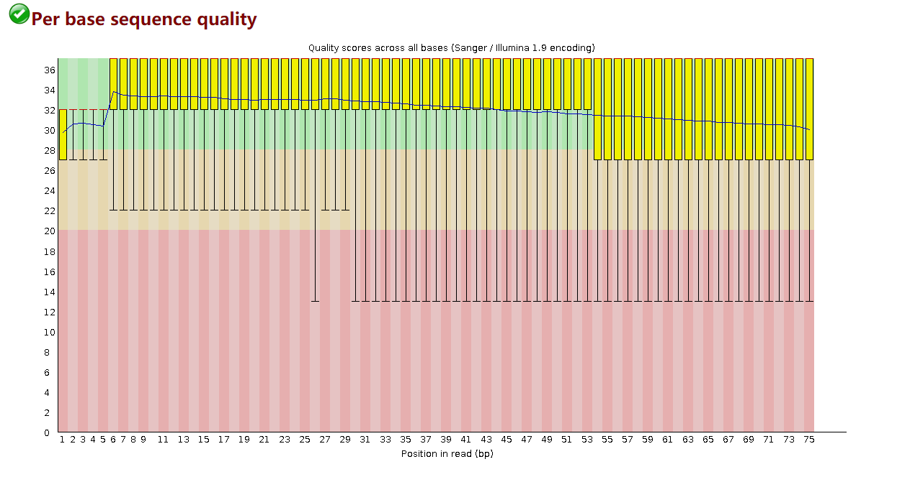
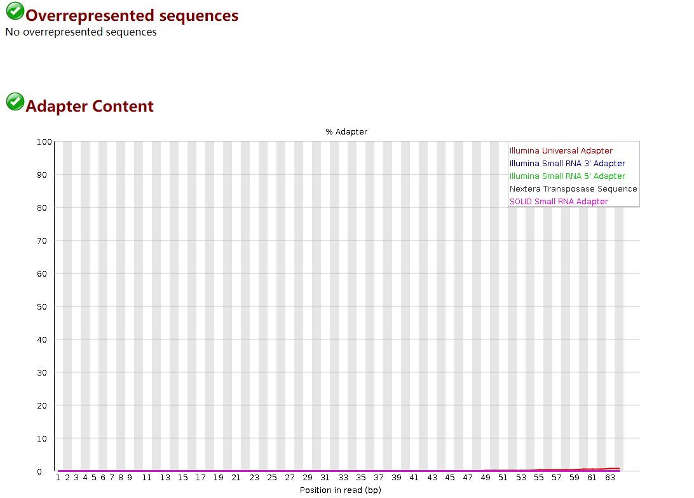
multiqc结果：
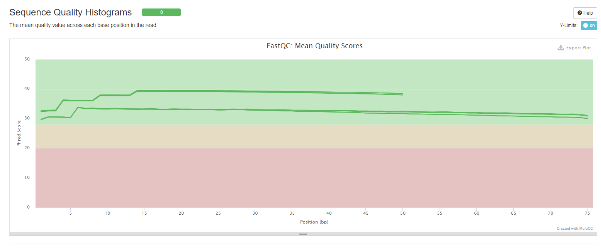
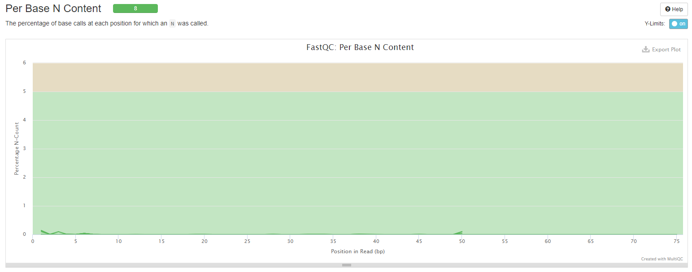
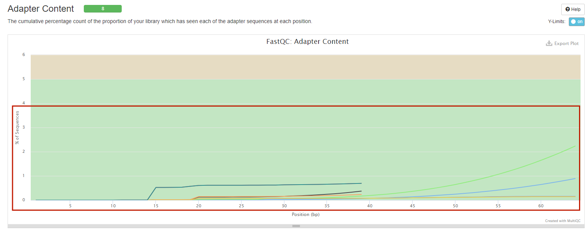
可以发现利用fastp去接头效果明显，处理后的数据全部满足条件。
##bwa比对
构建索引：
```
bwa index mm10.fa -p genome
```
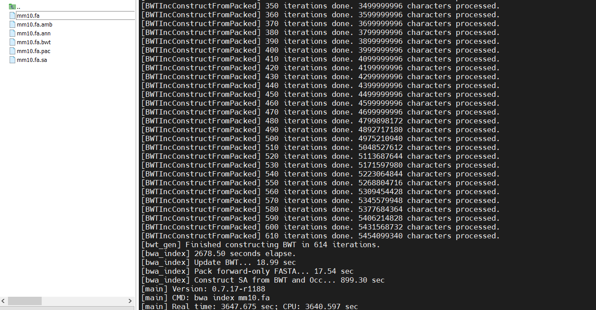
比对：
```
ls *fastq.gz | sed 's/.fastq.gz//g' | sort -u | while read id; 
do
	bwa mem -t 10 /public/workspace/stu19230111/reference/index/bwa/mm10.fa ${id}.fastq.gz > ./align/${id}.sam;
done
```
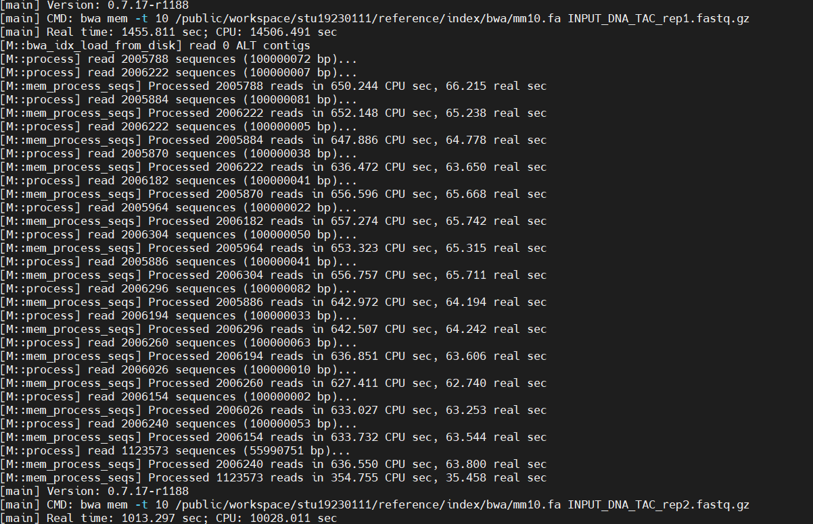
查看比对率：
```
samtools flagstat -@ 8 /public/workspace/stu19230111/MeDIP-Seq/fastq/clean/align/5hmC_Adult_rep1.sam
```
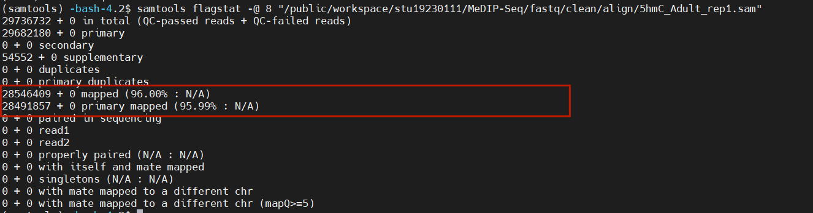
##饱和度分析
首先是转为二进制文件bam：
```
ls *.sam > sam_name
cat sam_name | sed 's/.sam//g' | while read id ; 
do
       samtools view -b -o ${id}.pe.bam -@ 4 ${id}.sam;
done
```
用MEDIPS包取映射后评估质量控制和饱和度分析：
```
library("MEDIPS")
library("BSgenome")
library("BSgenome.Mmusculus.UCSC.mm10")
BSgenome="BSgenome.Mmusculus.UCSC.mm10"
#为了避免PCR扩增引起的人工干扰，MEDIPS通过全基因组范围内堆叠reads的泊松分布和给定的p值来确定允许每个基因组位置的堆叠reads数：
uniq=1e-3
extend=300
#reads延伸长度，主要根据MeDIP处理时碎裂DNA得到的片段的平均长度设定
#例如reads长度为50bp，而碎裂的片段平均长度为300bp，则参数extend=250bp。
#此外，需要注意：如果是双末端测序reads，无需延伸，即参数extend=0
shift=0
ws=200
Adult_rep1 = MEDIPS.saturation(file = "5hmC_Adult_rep1.pe.bam", BSgenome = BSgenome,
    uniq = uniq, extend = extend, shift = shift, window_size = ws,
    , nit = 10, nrit = 1, empty_bins = TRUE,rank = FALSE)
png(file="Adult_rep1.png", bg="transparent")
MEDIPS.plotSaturation(Adult_rep1)
dev.off()
```
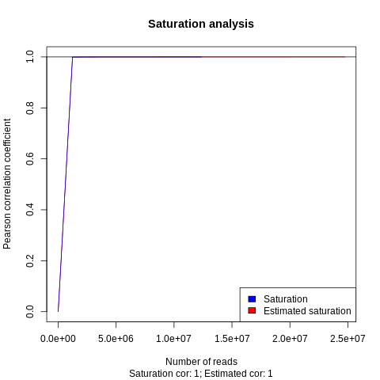
##Picard去重复
标记重复序列，标记PCR重复之前需要先coordinate sort，最后去除PCR重复。
```
ls *.pe.bam > pe.bam_name
cat pe.bam_name | sed 's/.pe.bam//g' | while read id ;
do
	picard SortSam   -I   ${id}.pe.bam   -O   ${id}.pe.rg2.srt.bam   --SORT_ORDER coordinate; 
done
ls *.pe.rg2.srt.bam > pe.rg2.srt.bam_name
cat pe.rg2.srt.bam_name | sed 's/.pe.rg2.srt.bam//g' | while read id ;
do
	picard MarkDuplicates       -I ${id}.pe.rg2.srt.bam       -O   ${id}.pe.rg2.md.bam       -M ${id}.marked_dup_metrics.txt;
done
```
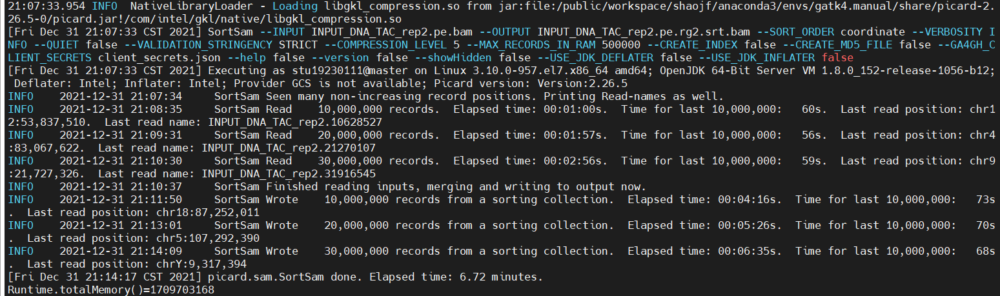
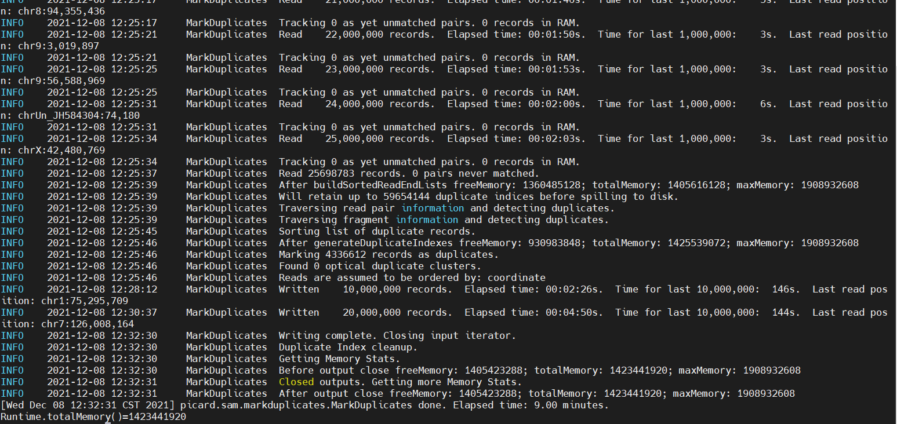
##使用bamtools过滤
使用bamtools工具过滤"mapQ"<10（mapping的质量值）：
```
ls *.pe.rg2.md.bam > pe.rg2.md.bam_name 
cat pe.rg2.md.bam_name | sed 's/.pe.rg2.md.bam//g' | while read id ; 
do
	bamtools filter -in ${id}.pe.rg2.md.bam  -mapQuality ">10" -out ${id}.pe.rg2.up10filter.bam
done
```
##HOMER来findpeaks
查看[Homer的官网](http://homer.ucsd.edu/homer/ngs/peaks.html)介绍，可以发现Homer来findpeaks需要tag directory
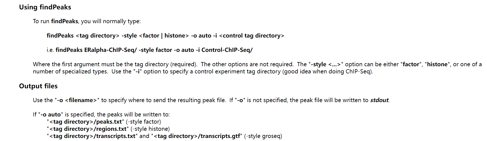
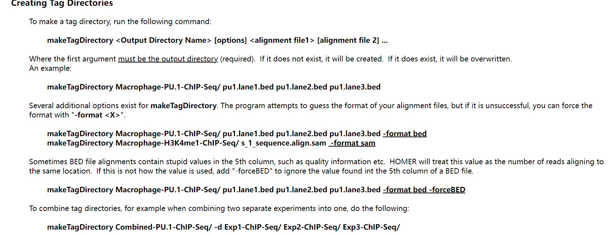
Create tag directory：
```
makeTagDirectory 5hmC_Adult_rep1.pe.rg2.up10filter 5hmC_Adult_rep1.pe.rg2.up10filter.sam -format sam
```
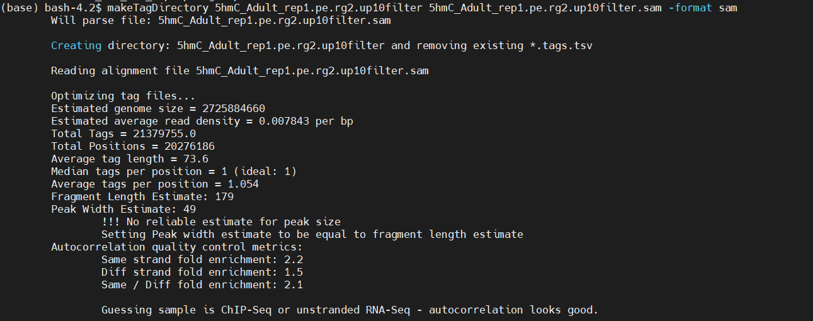
Findpeaks：
```
findPeaks 5hmC_Adult_rep1.pe.rg2.up10filter/ -i INPUT_DNA_Adult_rep1.pe.rg2.up10filter -style histone -o Adult_rep1.homer.peak.txt
```
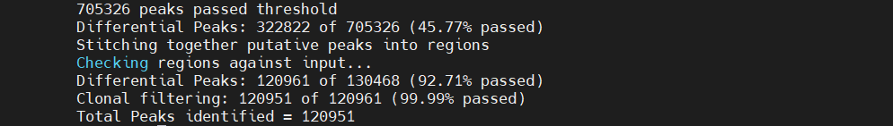
通常我们需要的文件为bed，这有利于上传UCSC以及IGV可视化
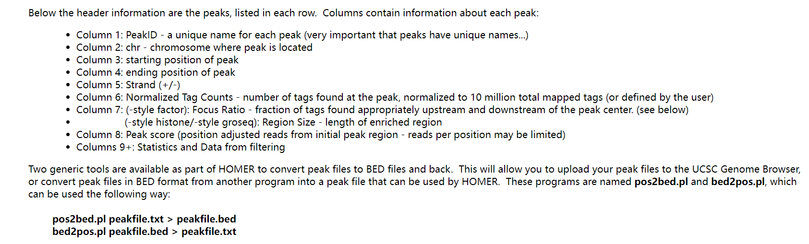
```
pos2bed.pl Adult_rep1.homer.peak.txt > Adult_rep1.homer.peak.bed
```
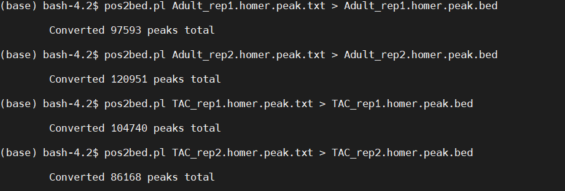
##bedtools合并重复样本的peaks
```
bedtools intersect -a Adult_rep1.homer.peak.bed -b Adult_rep2.homer.peak.bed > Adult_peaks_both.bed
bedtools intersect -a TAC_rep1.homer.peak.bed -b TAC_rep2.homer.peak.bed > TAC_peaks_both.bed
```
##[MEDIPS](http://master.bioconductor.org/packages/release/bioc/vignettes/MEDIPS/inst/doc/MEDIPS.pdf)差异分析
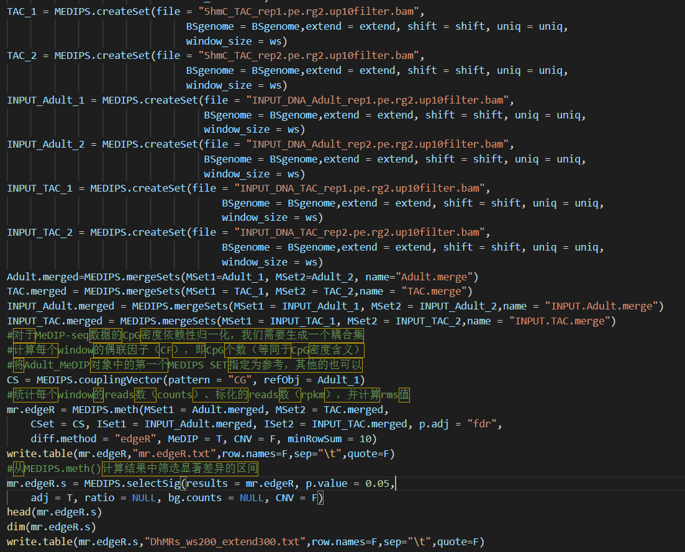
##DhMRs在生物复制中均达到峰值
```
sed '1d' DhMRs_ws200_extend300.txt > DhMRs_ws200_extend300.bed
bedtools intersect -a DhMRs_ws200_extend300.bed -b 5hmC_peaks_both.bed  -wa > DhMRs_ws200_both_rep.bed
```
##剔除DhMRs中ENCODE的黑名单区域
？？不知道需不需要
```
bedtools subtract -a DhMRs_ws200_both_rep.bed -b ~/reference/index/ENCODE_blacklist_mm10.bed -A > DhMRs_final.bed
```
##注释
###[ChIPseeker](https://www.jianshu.com/p/26aaba19a605)注释
```
bedPeaksFile = 'DhMRs_final.bed'; 
bedPeaksFile
## loading packages
require(ChIPseeker)
require(TxDb.Mmusculus.UCSC.mm10.knownGene)
txdb <- TxDb.Mmusculus.UCSC.mm10.knownGene
require(clusterProfiler) 
peak <- readPeakFile(bedPeaksFile)  
keepChr= !grepl('_',seqlevels(peak))
seqlevels(peak, pruning.mode="coarse") <- seqlevels(peak)[keepChr]
peakAnno <- annotatePeak(peak, tssRegion=c(-3000, 3000), 
                         TxDb=txdb, annoDb="org.Mm.eg.db") 
peakAnno_df <- as.data.frame(peakAnno)
head(peakAnno_df)
dim(peakAnno_df)
write.table(peakAnno_df,file="DhMRs_ws200_extend300_annotation.txt",row.names = F,quote = F,sep="\t")
pdf("peakanno.pdf")
plotAnnoPie(peakAnno)
dev.off()
```
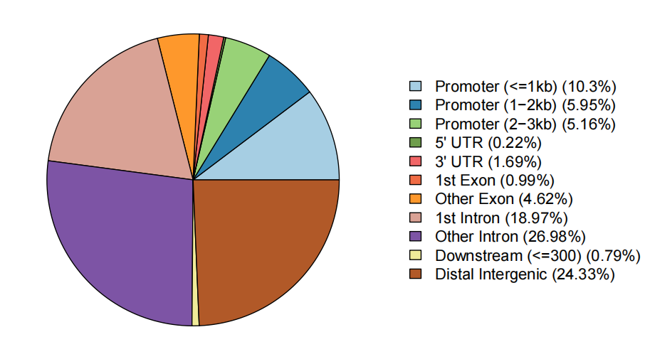
###homer注释
```
annotatePeaks.pl DhMRs_final.bed mm10 > peak.annotation.xls
```
##GO分析
这边用homer注释的文件进行分析的，会发现直接生成的xls文件在R中不能直接读取，可以复制重新存储
```
library(readxl)
data = read_excel("ceshi.xlsx", sheet = 1)
# Create a list with genes from each sample
library(clusterProfiler)
library(org.Mm.eg.db)
sym2ent <- bitr(data$`Gene Name`, fromType = "SYMBOL", 
                toType  = "ENTREZID", 
                OrgDb = org.Mm.eg.db)
# Run GO enrichment analysis 
ego <- enrichGO(gene         = sym2ent$ENTREZID,
                OrgDb         = org.Mm.eg.db,
                keyType       = 'ENTREZID',
                ont           = "ALL", #CC,BP,MF,ALL
                #pvalueCutoff  = 0.1,
                #qvalueCutoff  = 0.1,
                #minGSSize = 1, 
                # maxGSSize = 500, #
                readable = TRUE,)
# Dotplot visualization
pdf("GO_enrichment_DEG_ALL.pdf")
dotplot(ego,title="EnrichmentGO",)
dev.off()
```
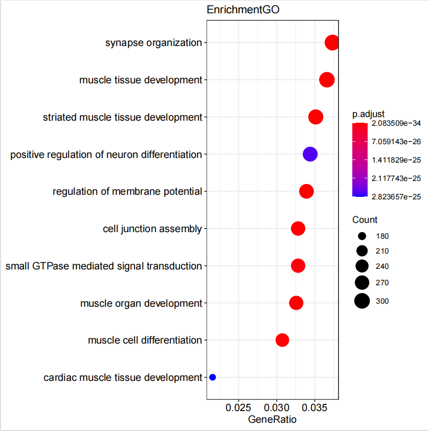
##KEGG分析
```
compKEGG <- enrichKEGG(gene = sym2ent$ENTREZID, 
                           organism = "mmu",
                           pvalueCutoff  = 1, qvalueCutoff =1)
pdf("KEGG_pathway_DEG_ALL.pdf")
dotplot(compKEGG,title="KEGG_pathway_ALL")
dev.off()
```
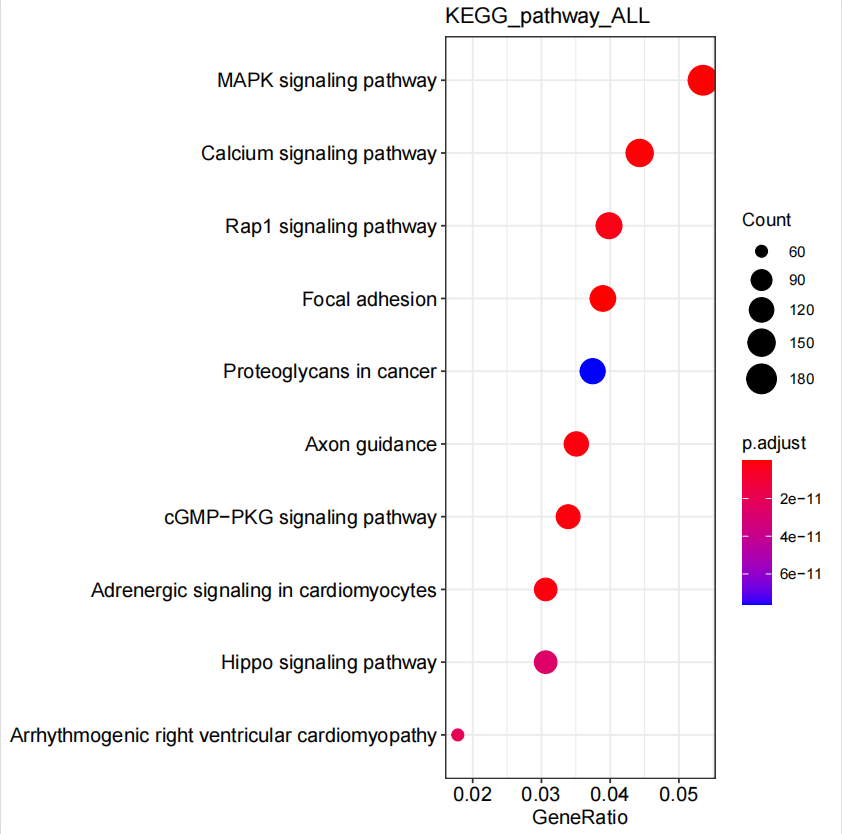


