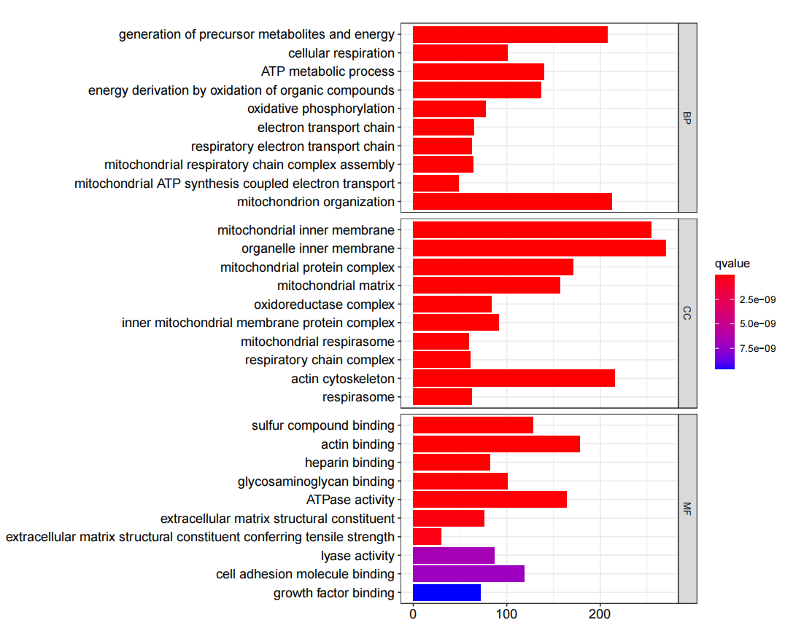
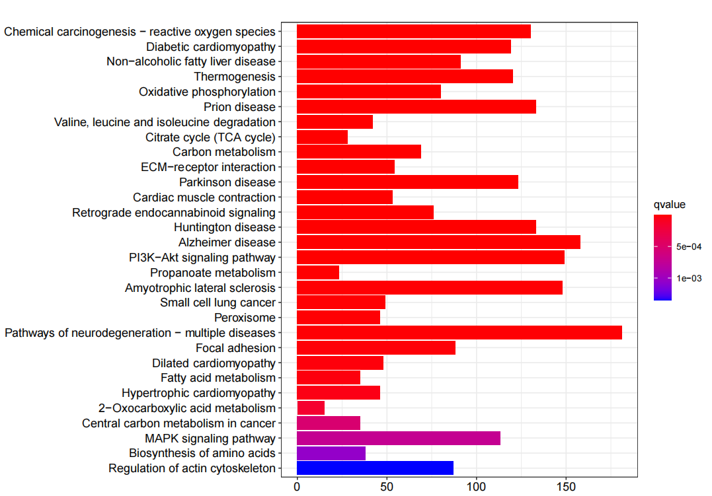
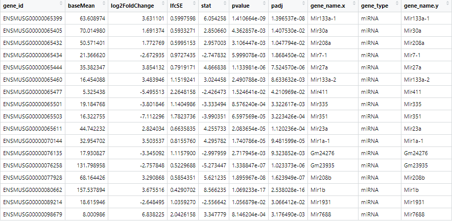

#RNA-Seq
##GO结果

##KEGG分析结果

##筛选差异的lncRNA
```
library("rtracklayer")
library("dplyr")
gtf_data = import('E:\\高通量\\gencode.vM25.annotation.gtf') #gtf的路径
#这里使用import导入gtf文件， 生成一个GRangs对象
gtf_data = as.data.frame(gtf_data)
data = as.data.frame(gtf_data[c('gene_id','gene_type','gene_name')])
data = data[data$gene_type == 'miRNA',]
library(stringr)
data[,1] <- str_split(data[,1],"\\.",simplify = T)[,1]
library("dplyr")
data = data %>% distinct()
res1 <- merge(res_df4,data,by="gene_id")
dfgene <-subset(res1, padj < 0.05 & abs(log2FoldChange) > 1)
```

