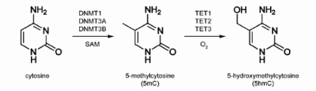
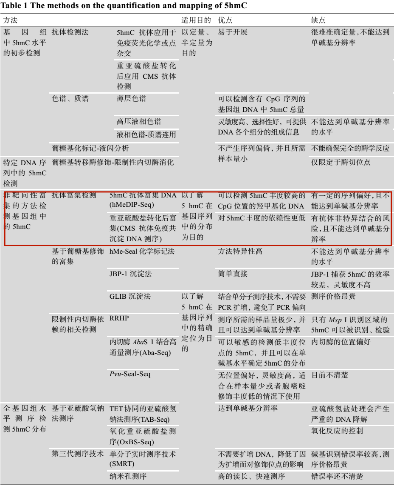

#基于RNA-Seq和hMeDIP-Seq探究DNA羟甲基化在小鼠发育过程中的心肌细胞基因表达

19230111 徐星雨

## 背景知识

5hmC被称为哺乳动物DNA中的“第六碱基”。早在上世纪70年代，Penn等人首次发现在哺乳动物DNA中存在5-羟甲基化胞嘧啶（5hmC）。然而该发现并未得到反复证实，因而5hmC也没有受到应有的重视。直到2009年，Kriaucionis和Tahiliani两位科学家证实小鼠的Purkinje细胞，颗粒神经元以及胚胎干细胞存在5hmC。5hmC可影响长期和短期的基因表达调控，因此在体内可能具有重要的生物学意义。

此外，在哺乳动物的其他组织中同样检测到大量5hmC的存在 (Globisch et al., 2010)。其中5hmC在中枢神经和脊髓中含量最高(0.3-0.7%)，在肾脏、鼻上皮细胞、膀胱、心脏、骨骼肌和肺部的含量居中(0.15 -0.17%)，而肝脏、脾脏和内分泌腺中的含量最低(0.03-0.06%)。宋红军等人利用敏感度更高的5hmC化学标记法对HeLa和HEK293细胞检测发现，5hmC大约占总核苷酸的0.001% (Song et al., 2011)。

DNA羟甲基化（DNA Hydroxymethylation）是DNA甲基化中5-甲基胞嘧啶（5mC）在TET家族酶的催化下发生氧化形成5-羟甲基胞嘧啶（5hmC）。5hmC就是研究DNA羟甲基化的意义所在。

5hmC具有非常重要的生物学功能，5hmC不仅参与了染色体重新编程、基因表达的转录调控，而且在DNA去甲基化过程中发挥重要作用。且研究显示5hmC与肿瘤的发生密切相关。

但与5mC 相比，5hmC在组织中含量更低，难以精确检测，研究难度大。目前广泛使用的金标准（亚硫酸氢盐转化，其次是深度测序）不能区分5mC和5hmC。美国芝加哥大学终身教授何川在现代生物学技术中嵌入了最新的化学合成技术，研发出化学标记检测技术（Nano-hmC-Seal），使其能够稳定重现微量DNA要求下的样本检测，为临床使用铺平了道路。

下面是5hmc检测的一些方法：

