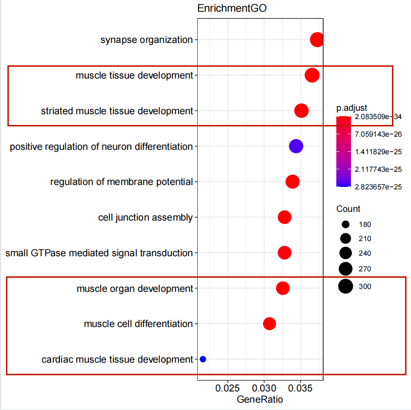
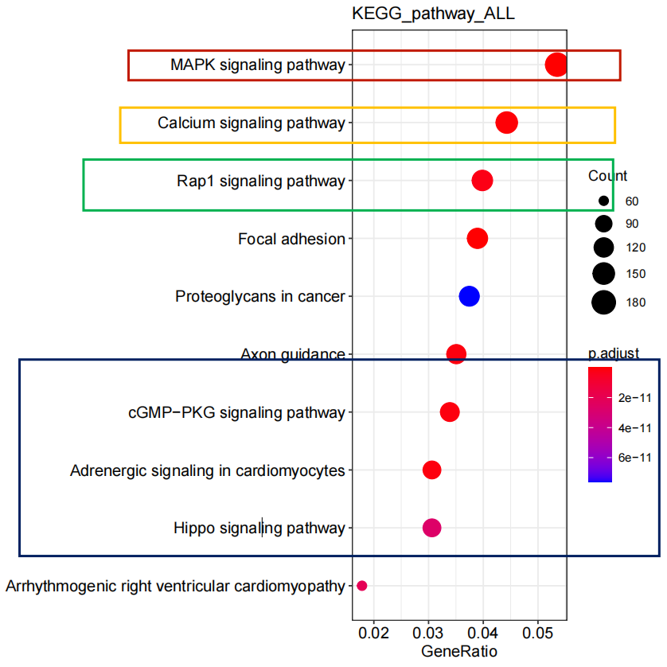
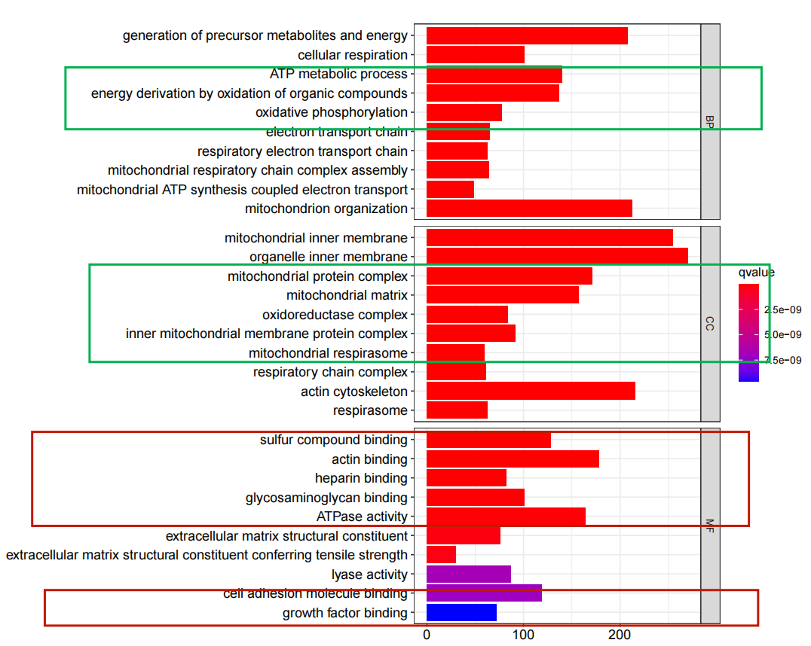
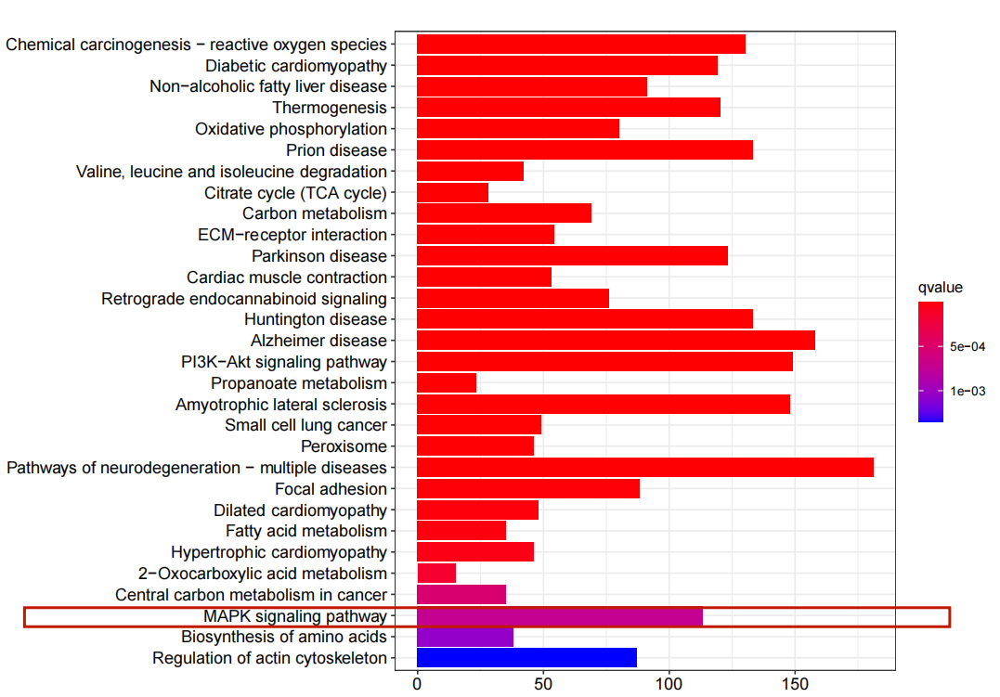
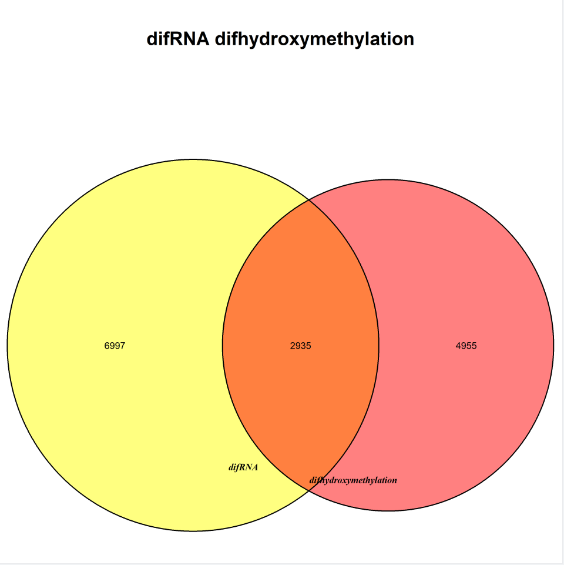

#Result
##差异羟甲基化区域
###GO结果分析

我们可以发现富集到肌肉组织发育、横纹肌组织的发育、肌肉器官发育、肌细胞分化、心肌组织的发育这些通路，这很明显与我们研究的内容相关，说明DNA羟甲基化在发育的不同阶段含量是不同的，他发挥着重要的调控作用。

接下来或许可以研究其中的某些基因如何被DNA羟甲基化调控！！
###KEGG结果分析

MAPK signaling pathway与心肌细胞的病理生理过程密切相关。[(3)](https://pubmed.ncbi.nlm.nih.gov/?term=%28MAPK+signaling+pathway%29+AND+%28Cardiomyocyte%29&sort=)
Calcium signaling pathway调节发育过程中和病理学中的基因表达和心肌细胞生长。[(4)](https://pubmed.ncbi.nlm.nih.gov/31308143/)
MAPK信号级联通过多种机制调节转录，包括转录因子、共激活因子、共加压子、组蛋白和基础转录机制的磷酸化和激活。活化的ERK1/2和/或p90RSK已被证明可以靶向c-Fos和Egr-1，并参与NF-κB的活化。 此外，c-Fos和Egr-1参与许多与细胞生长相关的基因的转录调控。在我们的研究中，PGE2c-Fos和Egr-1表达的刺激完全依赖于ERK1/2和p90RSK。此外，ERK1/2和p90RSK参与了BNP启动子的监管。转录因子GATA-4和激活蛋白（AP）-1（含有c-Jun和c-Fos家族成员）已被证明受MAPKs的调节，并且两种因子都调节hBNP启动子的基础和诱导活性。 因此，PGE2ERK1/2和p90RSK的依赖性激活可能靶向GATA-4和AP-1家族成员，增强其活性并刺激BNP启动子活性。[(4)](https://www.ncbi.nlm.nih.gov/pmc/articles/PMC2806144/)
可见KEGG的富集的通路与心肌细胞的发育和病理生理过程密切相关，值得我们关注！
##差异基因表达
###GO结果分析



在心肌细胞分化成熟以及心脏形态形成的过程中,心肌的生物能学改变以及线粒体生物学的改变是与心肌的结构功能改变同时发生的，生物能学和线粒体生物学的发育成熟应被视为正常心肌分化成熟过程中的重要组成部分。[(5)](https://xueshu.baidu.com/usercenter/paper/show?paperid=4b5244ccecf0813bacac596b3334580c&site=xueshu_se)
###KEGG结果分析



在差异羟甲基化和差异基因中都富集到MAPK，可见其对心肌细胞的发育有重要作用。
##VN图
```
setwd("C:\\Users\\86180\\Desktop\\meseq")
library(readxl)
ceshi = read_excel("ceshi.xlsx", sheet = 1)
ceshi1 = as.data.frame(ceshi)
ceshi2 = ceshi1[-which(is.na(ceshi1$`Gene Name`)),]

library(VennDiagram)
venn.diagram(
  x = list(
    "difRNA" = rownames(diff_gene),
    "difhydroxymethylation" = ceshi2$`Gene Name`
  ),
  resolution = 300, imagetype = "tiff", alpha=c(0.5,0.5),
  fill=c("red","yellow"), cat.fontface=4,fontfamily="ARL",
  main="difRNA difhydroxymethylation",
  main.cex = 2, main.fontface = 2, main.fontfamily = "HEL",
  filename = "VennDiagram.tif"
)
```



通过交集，可以发现有部分基因的表达确实与羟甲基化的修饰有密切关系，但不单单只是用羟甲基化这一种修饰来完全解释的。

##展望
那么不能用羟甲基化解释的，接下来可以通过对差异表达的非编码RNA与差异羟甲基化的关系，来探寻是否是由于羟甲基化导致非编码RNA的差异表达，从而作用于mRNA，从而导致的差异表达，这或许能解释一部分未能取到交集的那些基因。

期待之后的学习来进行探究！
